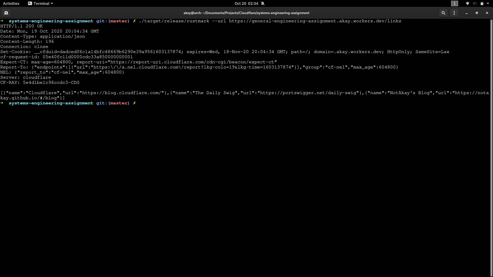
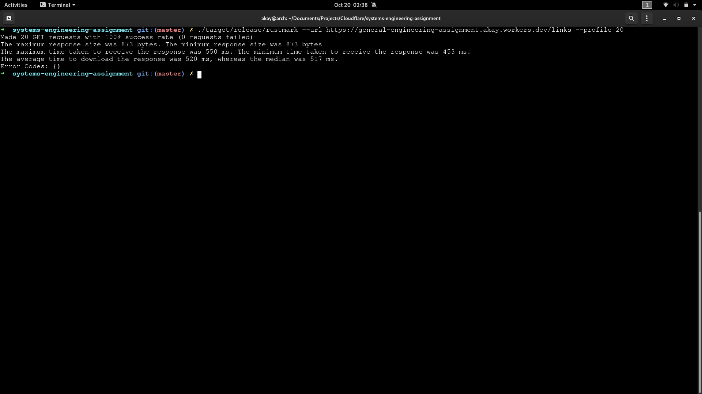
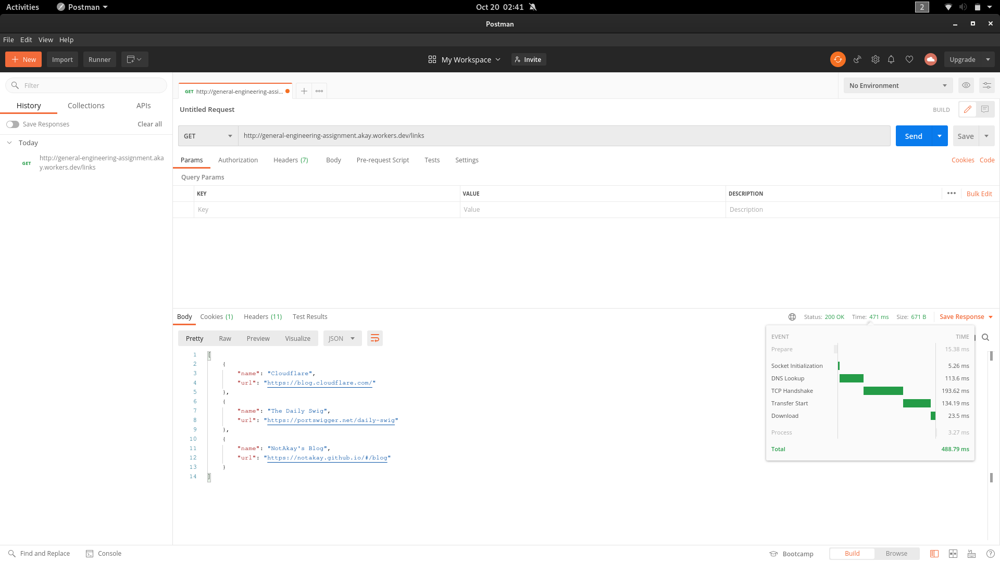
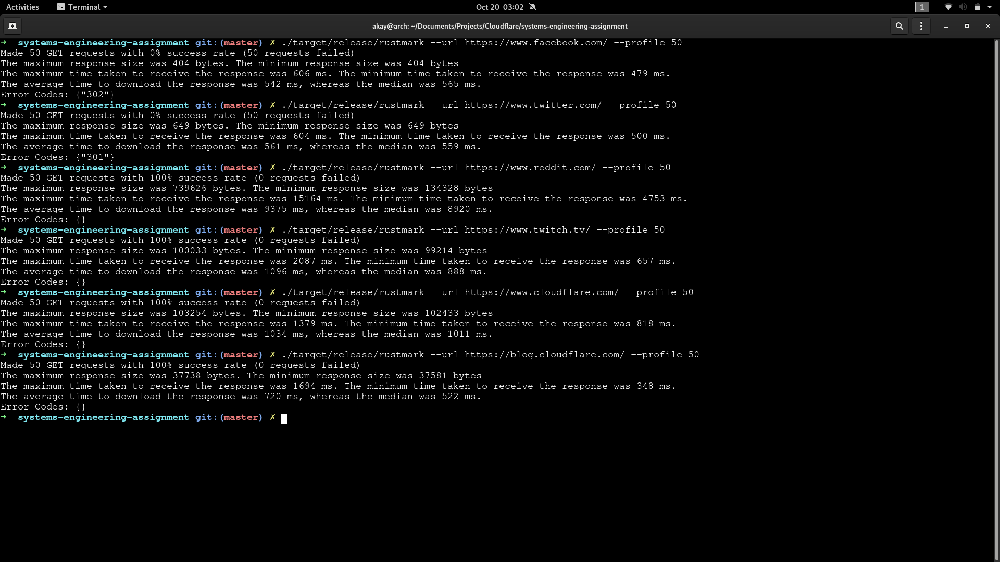

# Systems Assignment - Rustmark

## What is it?

This is a program built using Rust that performs HTTP requests. The `--url` argument can be used as a knockoff version of [curl](https://curl.haxx.se/).

The powerful thing about this program is that it can be used to benchmark web servers, using the `--profile` argument. This argument allows you to profile your web server by performing multiple GET requests per second and see how your sever holds up. This argument provides useful information such response times, error codes (if any), etc.

(Also supports HTTP over SSL using openssl. If a protocol isn't defined in the URL, the program will assume HTTP on port 80.)

## Build Instructions

Have Rust and Cargo installed on your computer. Check out this [link](https://www.rust-lang.org/tools/install) if they're not installed yet.

Run either `cargo build` or `cargo build --release` to download all dependencies and compile the program. The `--release` flag allows optimizations.

If `cargo build` was used, the program should be found at `target/debug/rustmark`. If the `--release` flag was included, the program should be at `target/release/rustmark`.

## Running Rustmark

`rustmark --help` to display the help menu.

`rustmark --url https://www.example.com/resource` to get contents at that URL

`rustmark --url https://www.example.com/resource --profile N` to perform N number of requests to that resource, benchmarking the times taken for the server to respond. Note that `N` is the number of requests that'll be made to the server and the number of threads that'll be spawned on the machine. Too many requests may lead to Denial of Service, which may lead to undesirable consequences. For smaller and medium sized web servers, start around 20 requests.

## Screenshots

Running rustmark url on `https://general-engineering-assignment.akay.workers.dev/links`

Running rustmark benchmark on `https://general-engineering-assignment.akay.workers.dev/links`

Comparing response times and sizes using Postman. Response times were pretty close. Some discrepancy in the sizes due to additional headers from server for Rustmark.

Benchmarking top websites. Was unable to benchmark Twitter and Facebook due to redirects. Possibly handle redirects in the future. Cloudflare does really well against some of the websites here.